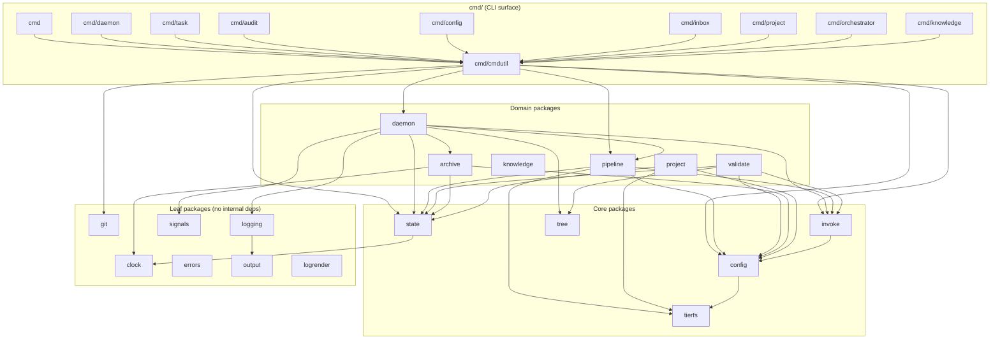

# Contributing to Wolfcastle

## Package Structure

Wolfcastle is a Go CLI with 20 internal packages. Here's the map:

| Package | What it does |
|---------|-------------|
| `internal/state` | Types, I/O, mutations, navigation, propagation for the distributed state files |
| `internal/daemon` | Iteration loop, stages, retry, signal handling, spinner |
| `internal/pipeline` | Prompt assembly, fragment resolution, script reference filtering |
| `internal/invoke` | Model CLI subprocess execution, marker detection, terminal restoration |
| `internal/config` | Three-tier config loading, deep merge, validation |
| `internal/validate` | Structural validation engine: 28 validation categories, multi-pass deterministic repair, JSON recovery |
| `internal/tree` | Address parsing, slug validation, filesystem path resolution |
| `internal/logging` | Per-iteration NDJSON log files, rotation, retention |
| `internal/output` | JSON envelope formatting, PrintHuman, spinner animation |
| `internal/project` | Scaffolding (init), embedded templates, project creation |
| `internal/archive` | Timestamped archive entries for completed nodes |
| `internal/errors` | Typed error categories (Config, State, Invocation, Navigation) |
| `internal/clock` | Time abstraction for deterministic testing |
| `internal/selfupdate` | Binary self-update mechanism |
| `internal/git` | Git operations behind a Provider interface for real repositories or test stubs |
| `internal/knowledge` | Per-namespace codebase knowledge files (add, show, edit, prune, token budget) |
| `internal/logrender` | Log record rendering (summaries, thoughts, session views) |
| `internal/signals` | Canonical OS signal set (SIGINT, SIGTERM, SIGTSTP) for graceful shutdown |
| `internal/tierfs` | Three-tier file resolution (base < custom < local) and tier name registry |
| `internal/testutil` | Shared test helpers |

The `cmd/` directory mirrors the CLI surface: `cmd/daemon/` (start, stop, log, status), `cmd/task/` (add, claim, complete, block, unblock, deliverable, scope), `cmd/audit/` (breadcrumb, gap, scope, summary, etc.), `cmd/config/` (show, set, unset, append, remove, validate), `cmd/orchestrator/`, `cmd/inbox/`, `cmd/project/`, `cmd/knowledge/` (add, show, edit, prune). Shared command utilities live in `cmd/cmdutil/`.

## Adding a CLI Command

1. Create a file in the appropriate `cmd/` subdirectory (e.g., `cmd/task/newcmd.go`)
2. Define a `newXxxCmd(app *cmdutil.App) *cobra.Command` function
3. Register it in the subdirectory's `register.go` with flags and completions
4. Add the command to the execute stage's `AllowedCommands` in `internal/config/config.go` if models should use it
5. Add the command to `internal/project/templates/prompts/script-reference.md`
6. Write a doc page in `docs/humans/cli/`
7. Write tests in the same package

If the command generates a file (like `adr create` or `spec create`), use the template system rather than building content with string concatenation or `fmt.Sprintf`:

1. Create a `.tmpl` file under `internal/project/templates/artifacts/` using Go `text/template` syntax
2. Define a typed context struct for the template variables (e.g., `ADRContext`, `SpecContext`) in `internal/pipeline/template_data.go`
3. Render via `PromptRepository.RenderToFile(tmplName, data, destPath)`, which resolves the template through the three-tier system so users can override the format
4. Add a snapshot test that renders the template with representative data and compares against a golden file

## Adding a Validation Check

1. Add a category constant in `internal/validate/types.go`
2. Add the check in `internal/validate/engine.go` inside `ValidateAll`
3. If the fix is deterministic, add it in `internal/validate/fix.go`
4. Write tests that trigger the validation and verify the fix
5. Update the structural validation spec in `docs/specs/`

## Test Expectations

- `go test -race ./...` must pass with zero failures
- Use `t.Parallel()` on every test
- Use `t.Helper()` on test helpers
- Table-driven tests for multiple similar cases
- Test error paths, not just happy paths
- Integration tests in `test/integration/` exercise real command sequences
- Smoke tests in `test/smoke/` verify the binary builds and runs

## PR Process

- Branch from `main` (always pull first)
- CI must pass: build, vet, gofmt, test (race detector), lint, cross-compile
- PRs auto-merge when CI passes
- Keep commits focused. One concern per commit.

## Architecture

Dependencies flow strictly downward. Domain packages orchestrate core packages. Core packages depend only on each other and on leaf packages. Leaf packages have no internal dependencies.

95 ADRs document every major design decision. Read `docs/decisions/INDEX.md` before making architectural changes. If your change introduces a new pattern or reverses an existing decision, write an ADR.
