# The TUI

Bare `wolfcastle` launches the terminal interface. No subcommands, no flags. The TUI is the primary way to operate Wolfcastle: watching work unfold, feeding the inbox, starting and stopping daemons, navigating the project tree. Everything the daemon does is visible here in real time.

The [CLI](cli.md) remains available for scripting, automation, and agent integration. Anything you can see in the TUI, you can query from the command line. The TUI is for humans at a keyboard.

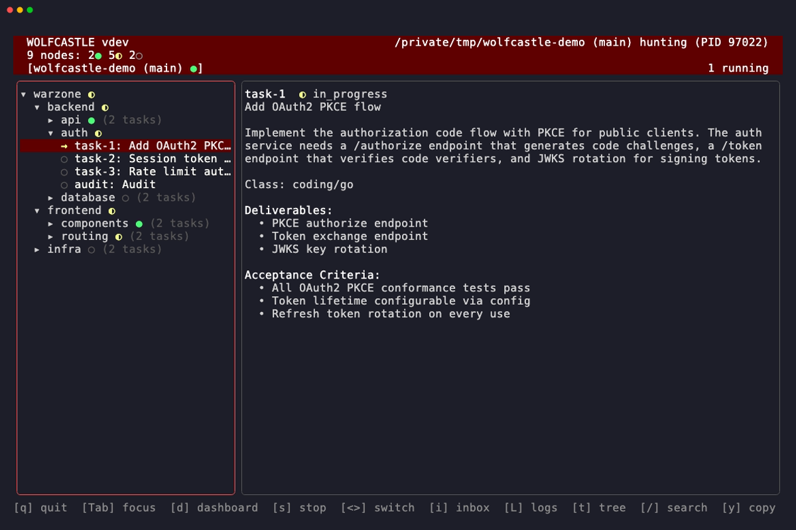

## Launching

The TUI opens in one of three states depending on the project directory:

| State | Condition | What you see |
|-------|-----------|--------------|
| **Live** | `.wolfcastle/` exists, daemon running | Tree pane, dashboard, live updates |
| **Cold** | `.wolfcastle/` exists, no daemon | Tree pane, dashboard (static), daemon controls |
| **Welcome** | No `.wolfcastle/` directory | Session browser and directory navigator |

If you run `wolfcastle` inside an initialized project with a running daemon, you land in the live view immediately. If the daemon isn't running, you get the same layout but static, with the option to start one. Outside any project, the welcome screen lets you find or create one.

## The Welcome Screen

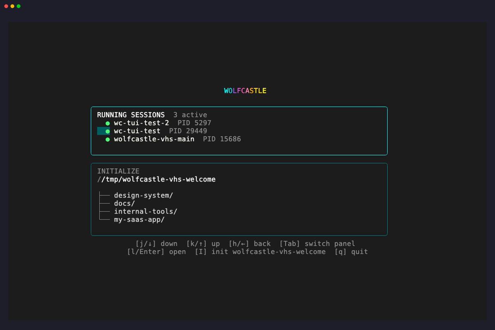

Two panels, stacked. The top panel lists running Wolfcastle sessions across your machine: any daemon that's alive shows up here with its branch, directory, and PID. It only appears when at least one session is active. Below it, the directory browser shows the contents of your current location under the "INITIALIZE" heading.

`Tab` switches focus between panels when both are visible. `j`/`k` move the cursor within whichever panel is focused. In the directory browser, `Enter` or `l` navigates into a directory, `h` goes up a level. Selecting a running session connects to it. `I` initializes a new project in the current directory.

The welcome screen is a launcher. Once you connect to a session or navigate into an initialized project, the TUI transitions to the live or cold state and the welcome screen disappears.

| Key | Action |
|-----|--------|
| `j` / `↓` | Move down |
| `k` / `↑` | Move up |
| `Enter` / `l` / `→` | Select session or navigate into directory |
| `h` / `←` / `Backspace` | Go up one directory |
| `g` | Jump to top |
| `G` | Jump to bottom |
| `Tab` | Switch panel focus |
| `I` | Initialize project in current directory |
| `q` | Quit |

## Layout

The main interface is a four-part layout:

```
┌─────────────────────────────────────────────────────────┐
│ Header: version │ daemon status │ node counts │ tabs    │
├──────────────┬──────────────────────────────────────────┤
│              │                                          │
│  Tree pane   │            Detail pane                   │
│              │                                          │
│              │  (dashboard, node detail, task detail,   │
│              │   inbox modal, log modal)                │
│              │                                          │
├──────────────┴──────────────────────────────────────────┤
│ Footer: key hints                                       │
└─────────────────────────────────────────────────────────┘
```

**Header** shows the Wolfcastle version, daemon status (running/stopped, branch, uptime), node counts by state, audit summary, and instance tabs when multiple daemons are active. A braille spinner animates while the daemon is running.

**Tree pane** on the left displays the project tree. Orchestrators and leaves, expandable and collapsible, with status glyphs showing progress at a glance.

**Detail pane** on the right shows context for whatever is selected: the dashboard when nothing specific is focused, node or task detail when you drill in.

**Footer** is a single line of key hints that updates based on the current focus and mode.

`Tab` cycles focus between the tree pane and detail pane. `t` toggles the tree pane's visibility entirely, giving the detail pane the full width.

## The Tree

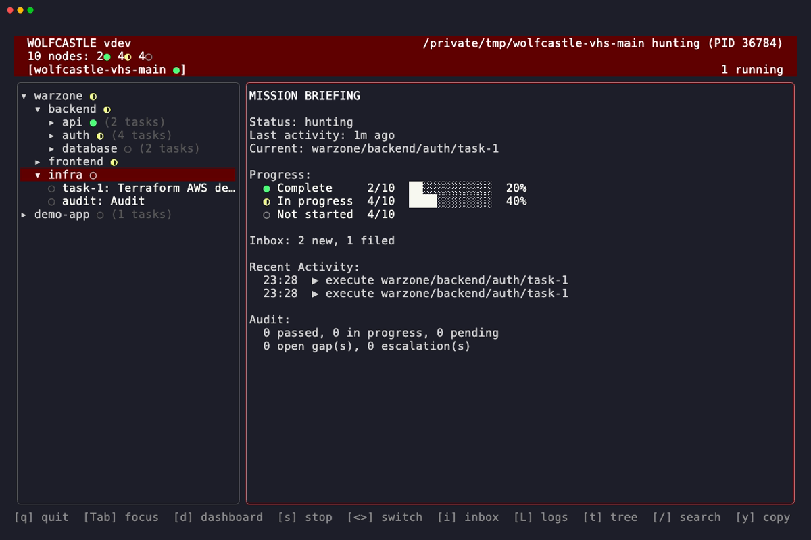

The tree pane renders the project hierarchy with status glyphs, expand/collapse indicators, and a cursor.

### Status Glyphs

| Glyph | Color | Meaning |
|-------|-------|---------|
| `●` | Green | Complete |
| `◐` | Yellow | In progress |
| `◯` | Dim | Not started |
| `☢` | Red | Blocked |

Tasks that are in progress show `→` (yellow arrow) instead of `◐`, matching the daemon's status output.

### Visual Indicators

- `▾` before a node name means it's expanded (children visible)
- `▸` means collapsed (children hidden)
- `▶` (bright yellow) marks the current target: the task the daemon is actively working on
- Selected rows get a dark red background
- Ancestor nodes of search matches get a muted olive background

### Navigation

| Key | Action |
|-----|--------|
| `j` / `↓` | Move down |
| `k` / `↑` | Move up |
| `Enter` / `l` / `→` | Expand node, or view detail if already expanded |
| `Esc` / `h` / `←` | Collapse node, or go back to parent |
| `g` | Jump to top |
| `G` | Jump to bottom |

`Enter` on an orchestrator expands it to show children. `Enter` on an expanded orchestrator or a leaf opens its detail view in the right pane. `Esc` reverses the last expansion or, if viewing a detail, returns to the dashboard.

## The Dashboard

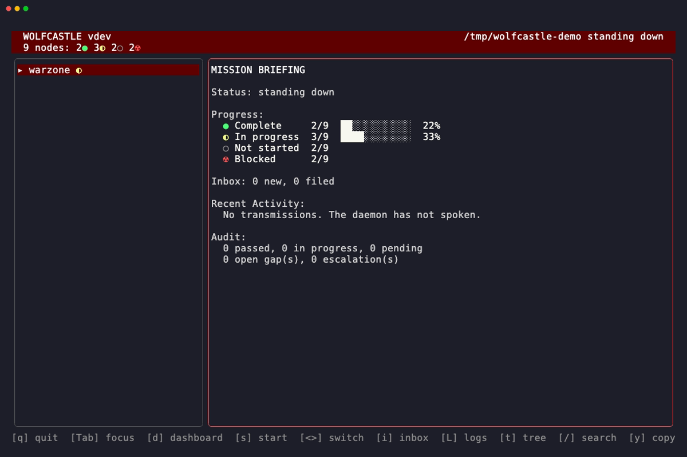

Press `d` from anywhere to return to the dashboard. It's the default detail view, the mission briefing.

The dashboard shows:

- **Daemon status**: running or stopped, current branch, uptime
- **Current target**: the node address the daemon is actively working on
- **Progress bars**: per-status counts (complete, in progress, not started, blocked) rendered as a horizontal bar with numeric labels
- **Inbox summary**: count of new and filed items
- **Recent activity**: the last 10 milestone events with timestamps (task completions, audit results, blocks, decompositions)
- **Audit summary**: passed/in-progress/pending counts, gap counts, escalation counts

Two terminal states replace the normal dashboard content:

- **"All targets eliminated"** when every node in the tree is complete
- **"Blocked on all fronts. Human intervention required."** when every remaining node is blocked

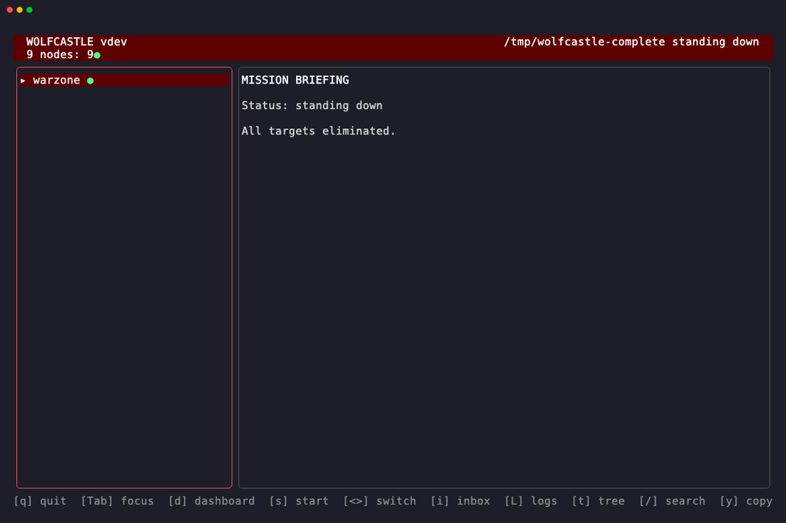


## Node Detail

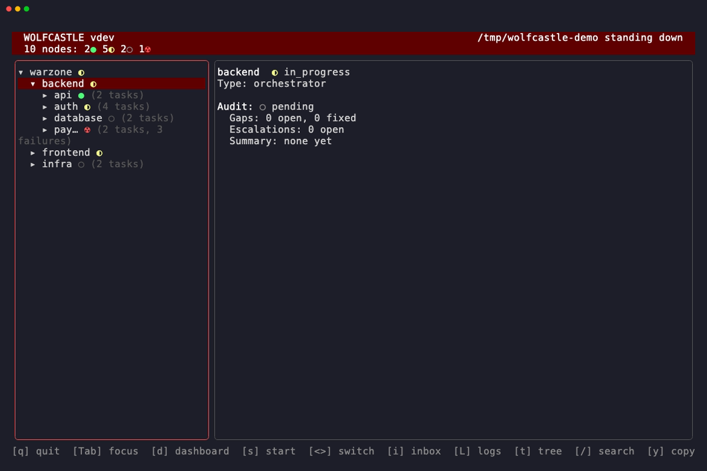

Press `Enter` on a tree node to open its detail view. The header shows the node name with its status glyph, node type (orchestrator or leaf), and address.

The detail includes:

- **Scope**: the files and directories this node covers
- **Success criteria**: what "done" means for this node
- **Children** (orchestrators): a list of child nodes with their states
- **Tasks** (leaves): the task list with per-task status glyphs
- **Audit section**: audit status glyph, started/completed timestamps, breadcrumb count, gap count, escalation count, and a result summary when the audit is finished
- **Specs**: linked specification files

The view scrolls if the content exceeds the terminal height.

## Task Detail

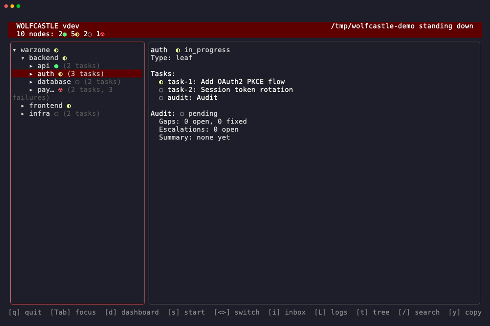

Press `Enter` on a task row within a node detail to see the full task. The header shows the task ID with its status glyph.

Fields displayed:

- **Title** and **description**
- **Body**: the full task specification
- **Class**: the [task class](task-classes.md) (e.g., `coding/go`, `research`)
- **Type**: the task type
- **Deliverables**: what the task should produce
- **Acceptance criteria**: how completion is verified
- **Constraints**: any limitations on the approach
- **References**: linked files, ADRs, specs

When the task is blocked:

- **Block reason**: why the task cannot proceed
- **Failure count**: how many times execution has failed
- **Last failure type**: the most recent failure classification
- **Needs decomposition**: whether the task has hit the decomposition threshold
- **Is audit**: whether this is an audit task

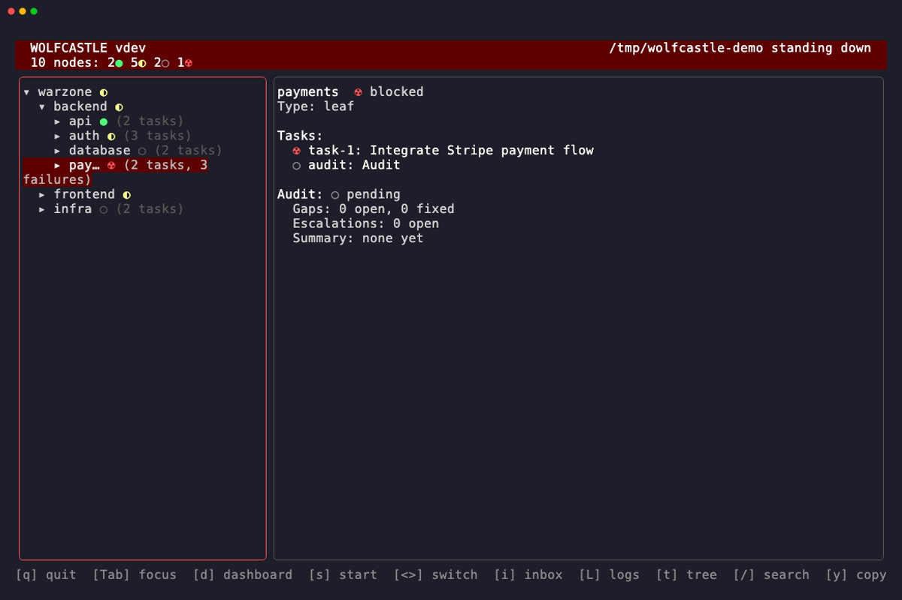

## The Inbox

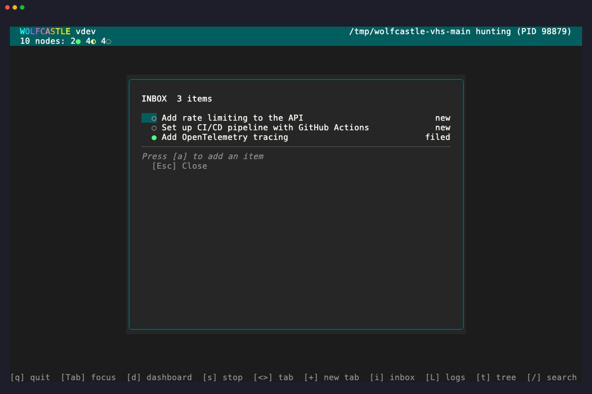

Press `i` to open the inbox modal. The inbox is a list of items you've submitted for the daemon to triage. Each item shows a glyph (`○` for new, `●` for filed), a status label, and a relative timestamp.

`j`/`k` navigate the list. Press `a` to add a new item: a text input appears at the bottom of the modal. Type your idea and press `Enter` to submit it. `Esc` cancels the input if you change your mind, or closes the modal entirely if no input is active.

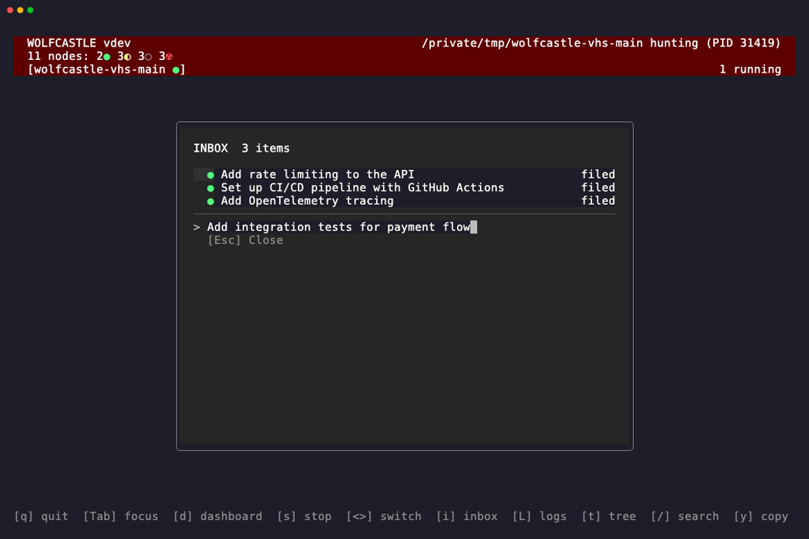

The inbox is the fastest path from thought to task. Type a sentence, hit Enter, and the daemon's intake stage picks it up, decomposes it into projects and tasks, and files them into the tree. You can also add items from the CLI with `wolfcastle inbox add`.

| Key | Action |
|-----|--------|
| `i` | Open inbox |
| `j` / `↓` | Move down |
| `k` / `↑` | Move up |
| `a` | Add new item (opens text input) |
| `Enter` | Submit new item |
| `Esc` | Cancel input, or close modal |

## The Log Stream

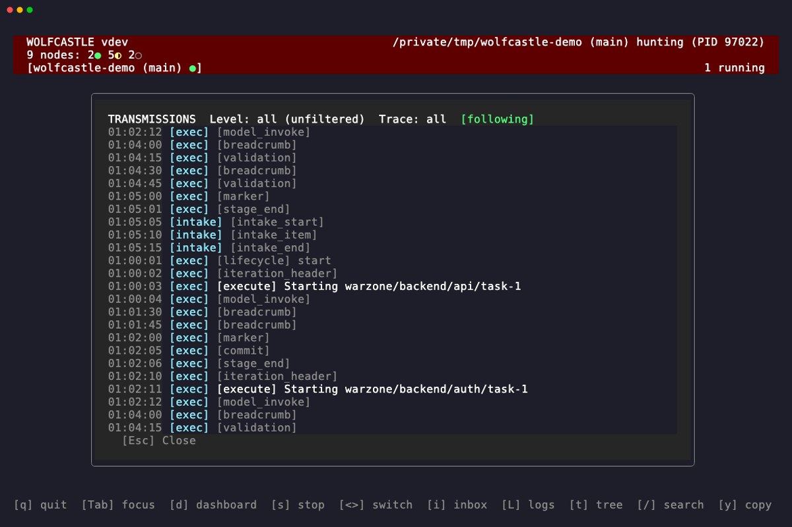

Press `L` (capital) to open the log stream modal. This is a live, scrollable, filterable view of the daemon's log output.

The header bar shows three indicators:

- **Level filter**: which log levels are visible (all, debug, info, warn, error)
- **Trace filter**: which traces are visible (all, exec, intake)
- **Follow indicator**: `[following]` (green) when auto-scrolling to new output, `[paused]` (yellow) when you've scrolled up manually

The log stream maintains a circular buffer of up to 10,000 lines. When log files rotate between daemon iterations, a visual separator (`── iteration N ──`) appears in the stream so you can see where one run ends and the next begins.

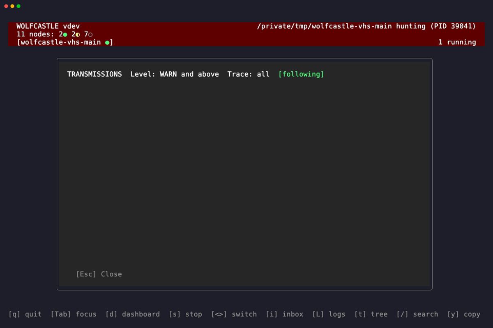

| Key | Action |
|-----|--------|
| `L` | Open log stream / cycle level filter (all → debug → info → warn → error) |
| `T` | Cycle trace filter (all → exec → intake) |
| `f` | Toggle follow mode |
| `j` / `↓` | Scroll down |
| `k` / `↑` | Scroll up |
| `g` | Jump to top |
| `G` | Jump to bottom |
| `Ctrl+D` | Half page down |
| `Ctrl+U` | Half page up |
| `Esc` | Close modal |

Scrolling manually pauses follow mode. Press `f` to re-enable it, or `G` to jump to the bottom (which also re-enables follow).

## Daemon Control

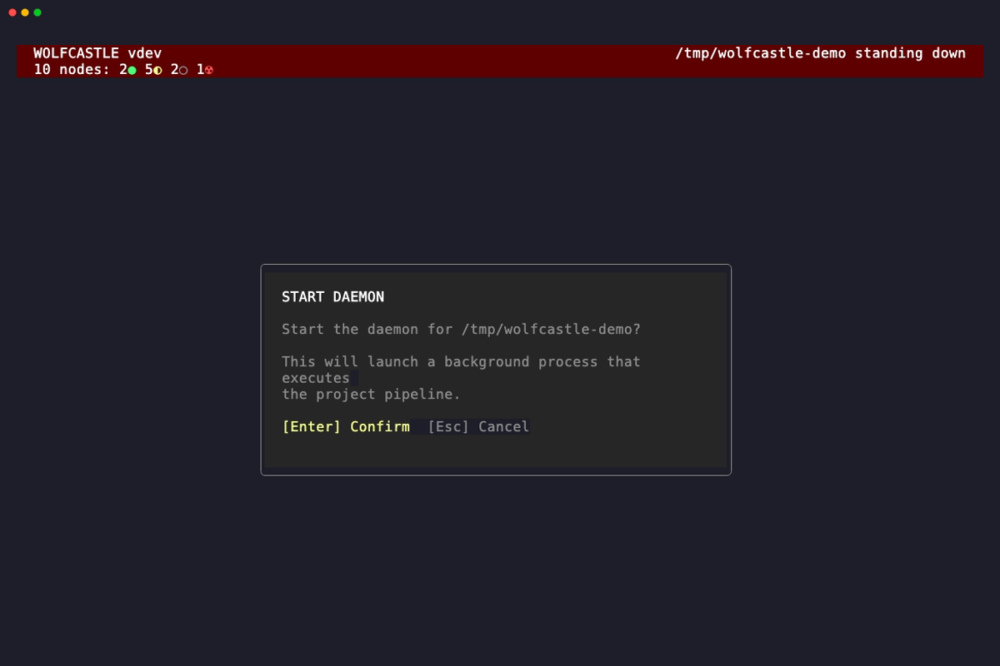

Press `s` to open the daemon control modal. If no daemon is running, the modal offers to start one. If a daemon is running, it offers to stop it. The modal shows contextual information: current branch, worktree path, and (when stopping) the daemon's PID and whether it's draining.

`Enter` confirms the action. `Esc` cancels without doing anything.

`S` (capital) stops all running daemons across all instances. Use this when you want a clean shutdown of everything.

| Key | Action |
|-----|--------|
| `s` | Start/stop daemon (opens confirmation modal) |
| `S` | Stop all daemons |
| `Enter` | Confirm |
| `Esc` | Cancel |

## Instance Switching

When multiple Wolfcastle daemons are running (different repositories, different branches, different worktrees), the header bar shows each as a tab. The active instance is highlighted.

`<` and `>` cycle through instances. `1` through `9` jump directly to an instance by position. The tree pane, dashboard, and all detail views update to reflect the selected instance.

| Key | Action |
|-----|--------|
| `<` | Previous instance |
| `>` | Next instance |
| `1`-`9` | Select instance by index |

## Search

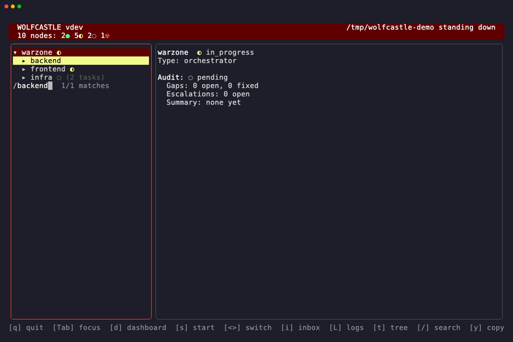

Press `/` to activate the search bar at the bottom of the screen. Type a query and press `Enter` to search the tree. `Esc` dismisses the search bar without searching.

Matches highlight in yellow. Ancestor nodes of matching nodes (nodes that contain a match deeper in the tree) get a muted olive background, so you can trace the path from root to match. These highlights are address-keyed: they survive expand and collapse operations.

`n` moves to the next match, `N` moves to the previous match. The cursor jumps to each match in the tree.

| Key | Action |
|-----|--------|
| `/` | Open search bar |
| `Enter` | Confirm search |
| `Esc` | Cancel search |
| `n` | Next match |
| `N` | Previous match |

## Notifications

Toast notifications appear in the upper right corner of the terminal. They announce events: task completions, blocks, audit results, daemon state changes. Each toast auto-dismisses after 3 seconds. Up to 5 toasts can stack. Long text is front-truncated to keep the meaningful part visible, with a maximum width of 60 characters.

Notifications are informational. They don't require interaction and won't block your workflow.

## Keybinding Reference

The complete set, organized by context. Press `?` to see this in the TUI itself.

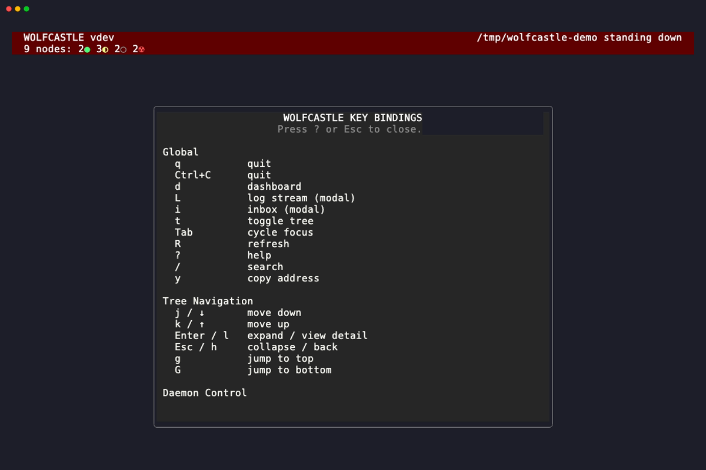

### Global

| Key | Action |
|-----|--------|
| `q` | Quit |
| `Ctrl+C` | Quit |
| `d` | Dashboard |
| `L` | Log stream (modal) |
| `i` | Inbox (modal) |
| `t` | Toggle tree |
| `Tab` | Cycle focus |
| `R` | Refresh |
| `?` | Help |
| `/` | Search |
| `y` | Copy address |

### Tree Navigation

| Key | Action |
|-----|--------|
| `j` / `↓` | Move down |
| `k` / `↑` | Move up |
| `Enter` / `l` / `→` | Expand / view detail |
| `Esc` / `h` / `←` | Collapse / back |
| `g` | Jump to top |
| `G` | Jump to bottom |

### Daemon Control

| Key | Action |
|-----|--------|
| `s` | Start/stop daemon (modal) |
| `S` | Stop all daemons |
| `<` `>` | Switch instance |
| `1`-`9` | Select instance |

### Inbox

| Key | Action |
|-----|--------|
| `i` | Open inbox |
| `a` | Add item |
| `Enter` | Submit |
| `Esc` | Cancel |

### Log Stream

| Key | Action |
|-----|--------|
| `L` | Open log stream |
| `j` / `↓` | Scroll down |
| `k` / `↑` | Scroll up |
| `g` | Jump to top |
| `G` | Jump to bottom |
| `f` | Toggle follow |
| `L` | Cycle level filter (all → debug → info → warn → error) |
| `T` | Cycle trace filter (all → exec → intake) |
| `Ctrl+D` | Half page down |
| `Ctrl+U` | Half page up |

### Search

| Key | Action |
|-----|--------|
| `/` | Start search |
| `Enter` | Confirm search |
| `Esc` | Cancel search |
| `n` | Next match |
| `N` | Previous match |

### Welcome Screen

| Key | Action |
|-----|--------|
| `j` / `↓` | Move down |
| `k` / `↑` | Move up |
| `Enter` / `l` / `→` | Select / navigate into |
| `h` / `←` / `Backspace` | Go up one level |
| `g` | Jump to top |
| `G` | Jump to bottom |
| `Tab` | Switch panel focus |
| `I` | Initialize project |
| `q` | Quit |
